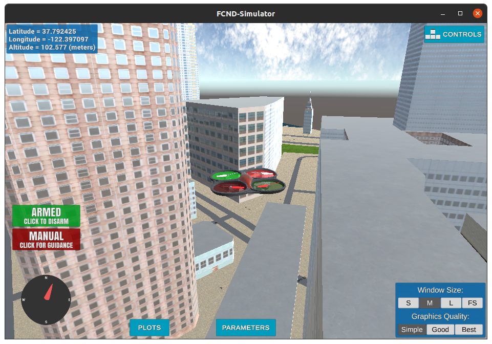
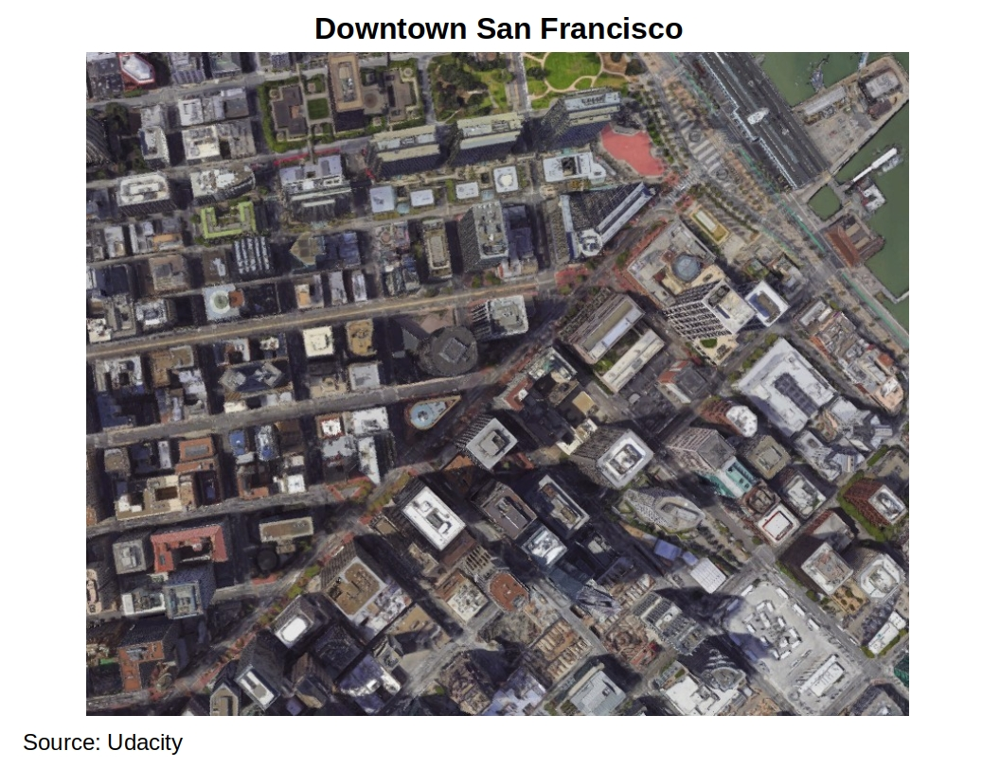
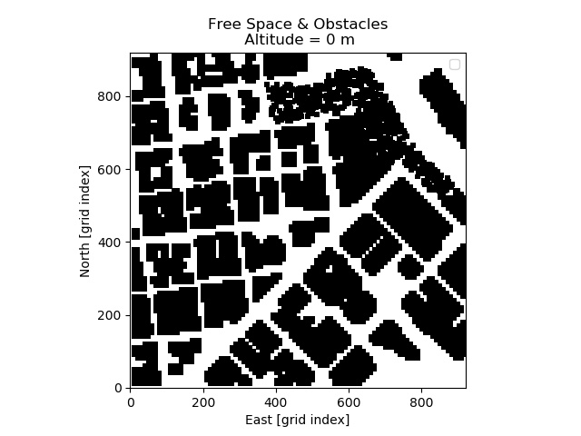
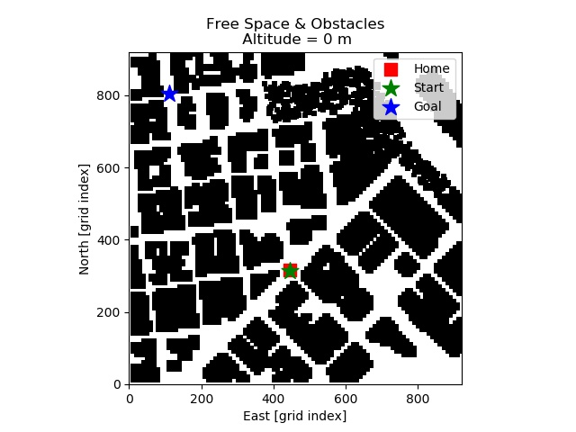
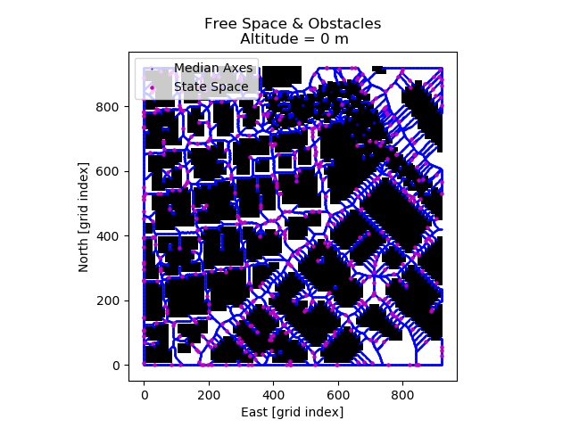
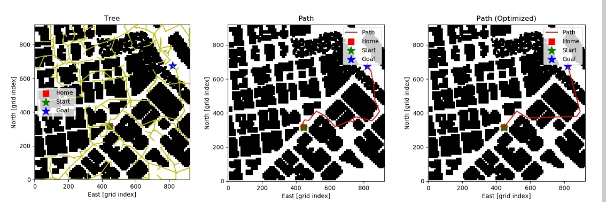
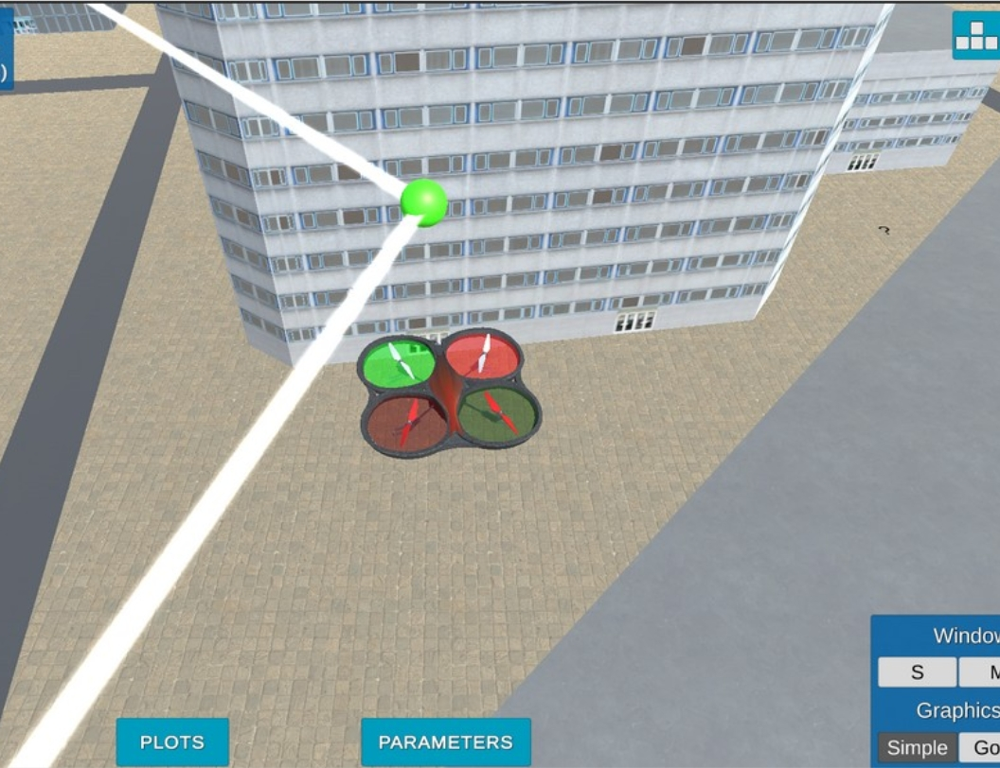
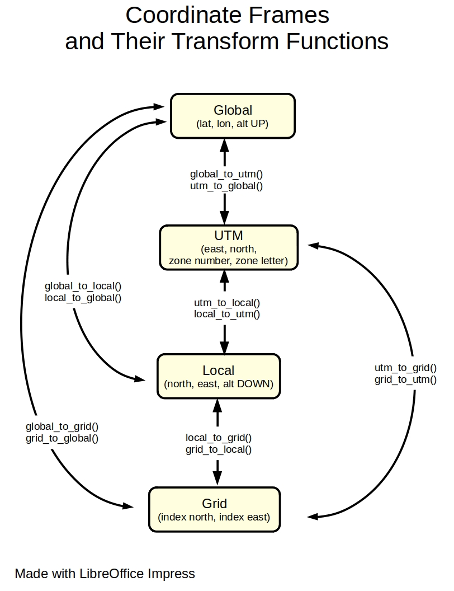

# Autonomous Drone 3D Path Planning

# Overview

Python code for deriving a drone trajectory and flying it autonomously on a San Francisco 3D map.

The path is generated with a Rapidly-Exploring Random Tree algorithm (RRT) [1]. The script is built upon the udacidrone API library [2][3] which itself relies on pymavlink [4]. The script is designed to be run in Udacity's Flight Simulator [5].

This project is part of Udacity's Autonomous Flight Engineer Nanodegree [6]. This README serves as a final report for the project.

# Video

https://youtu.be/V4rkXZcyLaU

# Install & Run

1 - Install Udacity's Flight Simulator.

    https://github.com/udacity/FCND-Simulator-Releases/releases

2 - Install Anaconda.

    https://www.anaconda.com

3 - Setup the fcnd environment, which is used by this project.

    mkdir -p /drone/flight_simulator
    cd /drone/flight_simulator
    git clone https://github.com/udacity/FCND-Term1-Starter-Kit.git
    (instructions are in file configure_via_anaconda.md)

4 - Clone this repository.

    mkdir -p /drone/projects/planning
    cd /drone/projects/planning
    git clone ...

5 - Launch the simulator (files might be different depending on your system).

    cd /drone/flight_simulator/linux-64-bit
    ./FCND-Sim_Linux_64-bit

6 - Launch the mission planning script.

    cd /drone/projects/planning
    source activate fcnd
    python main.py

Voila ! The script will now select a goal state on the map, find a route from your current location to the goal and fly the drone automomously on this route.

# [Optional] Udacity Starter Code

Udacity provided students with some starter code. This code is not required to run the script, but contains additional examples on how to use the udacidrone API. Briefly describing this starter code is a requirement of the project, so I am including this section.

**Starter code install procedure**

    mkdir -p /drone/projects/planning/udacity_starter_code
    cd /drone/projects/planning/udacity_starter_code
    git clone https://github.com/udacity/FCND-Motion-Planning.git

**Files of particular interest in the starter code**

`backyard_flyer_solution.py`

Gives an example on how to establish connection with the simulator, instance a Drone object, have the simulated drone take off to an altitude of 3 m, follow a square trajectory (10 meters north, east, south then west) then land. The Drone class relies heavily on events and callbacks. This file contains examples of such callbacks. An enumerator is also used for each drone state (i.e. flight phases).

`motion_planning.py`

Similar to backyard_flyer_solution.py, but with an additional plan_path method inside the Drone class. This method is meant to perform path planning before the drone starts its mission. This file acted as an empty shell for this project.

`planning_utils.py`

This file contains example functions for path planning. create_grid builds a 2D numpy array which represents a 2D discretization of the world into free space and obstacles. Free spaces are represented by 0's, obstacles, by 1's. a_star is an implementation of the A* search algorithm. heuristic calculates the Euclidian distance between 2 points and serves as a heuristic function for a_star. Actions is an enumerator of all possible actions (movements) in a grid cell (moving north / east / south / west). valid_actions returns possible actions at a specific location on a grid based on the surrounding obstacles.

# Planning Methodology

Planning is performed by the `plan` method of the `AutonomousDrone` class. This method follows the following steps.

**Define the planning problem**

- Define a state space.
- Define a start state.
- Define a goal state.
- Define actions for each state.
- Define costs for each state.

**Search for a plan (i.e. drone trajectory)**

- Run the RRT algorithm.
- Optimize the plan.

**Run the plan**

- Send the plan as waypoints to the simulator.
- Have the drone follow these waypoints.

# Define the Planning Problem

**World**

The world considered for this planning problem is a section of downtown San Francisco. This zone is approximatively 1 km^2 and centered around the Embarcadero BART station.

 
 

**2.5D Grid Representation**

The world is discretized into a 2.5D grid representation. This representation is made of the following.

- A table of the obstacle dimensions (colliders.csv).

     First line: drone home location.  
     Other lines: obstacle centers and half-widths in the local NEU frame (see "Coordinate Frames").

- A 2D grid representing free locations (0) and obstacles (1).

 

    $ head colliders.csv 

    lat0 37.792480, lon0 -122.397450
    posX,posY,posZ,halfSizeX,halfSizeY,halfSizeZ
    -310.2389,-439.2315,85.5,5,5,85.5
    -300.2389,-439.2315,85.5,5,5,85.5
    -290.2389,-439.2315,85.5,5,5,85.5
    -280.2389,-439.2315,85.5,5,5,85.5
    -220.2389,-439.2315,50,5,5,50
    -210.2389,-439.2315,50,5,5,50
    -170.2389,-439.2315,1.5,5,5,1.5
    -160.2389,-439.2315,1.5,5,5,1.5

 

**Home Location**

The home location is a point used for measuring distances in the local NED and NEU frames (see "Coordinate Frames"). It is defined on the first line of file `colliders.csv`.

**Start State**

The start state is set as the drone current location when the simulation opens, which is the same as the home location.

**Goal State**

The goal state is selected randomly in the 2D grid free space.

**State Space**

A state space is built from the 2.5D grid representation with the following steps.

- Find grid points on the median axes between obstacles.
- Sample points randomly on these median axes.
- Add the start and goal states to the state space.

**Actions**

The graph representing this problem is built by the search algorithm (see below). Possible actions at one node is simply moving to any adjacent node.

**Costs**

Action costs were not considered by the search algorithm.

# Search for a Plan

**Run the RRT Algorithm**

A Rapidly-Exploring Random Tree algorithm (RRT) was ran on the state space. A tree was developped by this algorithm. A path was then derived from this tree by tracing locations from the goal state to the start state.

NOTE. **Obstacle checking** was performed at the drone **cruising altitude**. Some tree / path edges may see to collide with obstacles, but at the drone altitude these are free space.

**Optimize the Plan**

Once a route was found from the start state to the goal state, intermediate locations which could be replaced by a straight line were removed.

 

# Run the Plan

Path nodes are then sent to the simulator. Each waypoint is displayed as a green sphere. The drone takes off and follows the path autonomously.

# Coordinate Frames

Locations in the world are expressed with several coordinate frames. Understanding these frames is key to using the udacidrone API. Variable names can have a prefix indicating which frame their values are expressed in.

|Prefix|Description|Coordinates|Origin|Comment|
|---|---|---|---|---|
|global|Global geodetic frame|(latitude [deg], longitude [deg], POSITIVE altitude[m])|In the ocean off the coast of Africa||
|utm|Universal Transverse Mercator Frame|(east [m], north [m], zone number, zone letter)|UTM zone 10S origin. |Used under the hood for converting between global and local frames.|
|local|Local NED frame (North-East-Down)|(north [m], east [m], NEGATIVE altitude[m])|Drone home location||
|grid|Local 2D grid frame|(north [grid index], east [grid index])|2D grid bottom left corner||
|neu|Local NEU frame (North-East-Up)|(north [m], east[m], POSITIVE altitude [m])|Drone home location|Non-standard frame. Does not respect the right-hand rule. Used by obstacle file and udacidrone cmd_position method.

 
`frames.py` provides functions for converting a location from a frame to another.
 

# Possible improvements

- When building the state space, add another check to find intersections of median axes. Eliminate states which are close of this intersection.

- Add a check which verifies if the goal is inside a closed space (i.e. entirely surrounded by building, so in free space but unreachable from the start state.)

- Rename variables `north_min` and `east_min` to `local_north_min` and `local_east_min`.

- Change the `local` prefix to `ned` for the local NED frame. Prefix `local` is ambiguous since there are 4 local frames in this project (UTM, NED, grid and NEU frames).

- Add frame prefix to `path` variable.

- The script crashes if the planning algorithm runs for more than 60 seconds. A MsgID.CONNECTION_CLOSED message seems to be raised. Couldn't figure out why. A timeout on the thread the algorithm is running in, maybe? To be investigated... 

- RRT could be replaced by RRT*, which would provide better results, but at an additional computational cost... To be investigated.

- Path planning is slow when run from a method of the AutonomousDrone class and fast when ran before the class is instantiated. Maybe planning could be performed before creating an AutonomousDrone object.

- Give the user the choice between several search algorithms (RRT, RRT*, A*, ...).

- Develop a small GUI with matplotlib widgets which pops up when the script is launched. This GUI could do some of the following.

    - Allow the user to select a search algorithm from a drop-down list.
    - See the path being built live.
    - Allow the user to press button "Replan" if the path isn't optimal.
    - Show the drone location updated live on a 2D map during its mission.
    - Allow the user to visualize/change parameters in file config.py.
    - Allow the user to toggle on/off some layers of the 2D map (median axes, state space, path, graph, ...).

# References

[1] Wikipedia, Rapidly-Exploring Random Tree, https://en.wikipedia.org/wiki/Rapidly-exploring_random_tree

[2] Udacity, udacidrone Library on github, https://github.com/udacity/udacidrone

[3] Udacity, udacidrone API documentation, https://udacity.github.io/udacidrone/docs/welcome.html

[4] MAVLink, pymavlink, https://mavlink.io/zh/mavgen_python/

[5] Udacity, Flight Simulator, https://github.com/udacity/FCND-Simulator-Releases/releases

[6] Udacity's Autonomous Flight Engineer Nanodegree. https://www.udacity.com/course/flying-car-nanodegree--nd787

